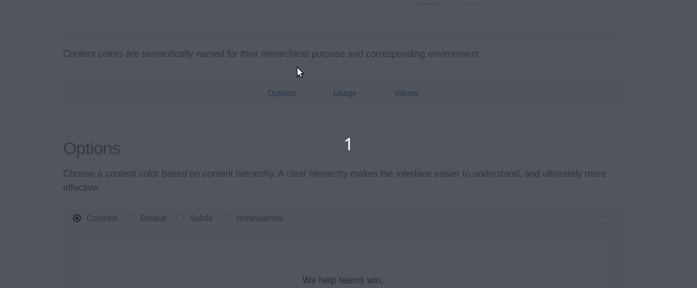
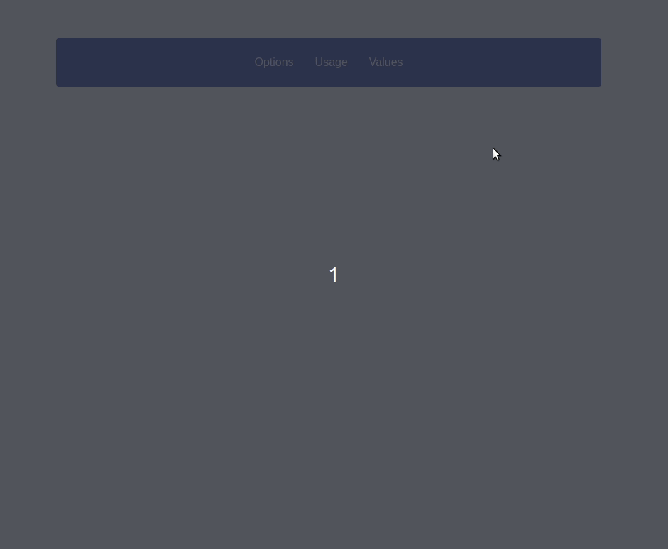

# Menu fixo quando scroll chegar até ele
A ideia hoje é reproduzir esse comportamento



Note que quando o scroll chega até o menu ele fica fixo e muda um pouco seu estilo. 

Esse exemplo foi tirado [desse](http://uniform.hudl.com/guidelines/colors/content/design/) guia de estilos.

Vamos começar criando o arquivo `index.html` na raiz do projeto.

Se você usa visual studio code é só digitar `!` e dar `tab` que automaticamente o vscode vai criar um documento `html 5` pra você. O arquivo ficará assim:
```html
<!-- index.html -->
<!DOCTYPE html>
<html lang="en">
<head>
  <meta charset="UTF-8">
  <meta name="viewport" content="width=device-width, initial-scale=1.0">
  <meta http-equiv="X-UA-Compatible" content="ie=edge">
  <title>Document</title>
</head>
<body>
  
</body>
</html>
```

Vamos começar criando nosso menu e posicionando ele no meio da página. Para isso vamos criar no arquivo de estilo separado. Crie um arquivo de estilo chamado `styles.css` na mesma hierarquia do arquivo `index.html` depois adicione o arquivo de estilos na tag `head`
```html
<!-- ... -->
<head>
  <!-- ... -->
  <link rel="stylesheet" href="./styles.css" />
</head>
<!--  -->
```

Para não ter que ficar recarregando a página toda vez que alterar o arquivo `index.html` ou `styles.css` instale o plugin [Live Server](https://marketplace.visualstudio.com/items?itemName=ritwickdey.LiveServer) do vscode.

O css para criar essse menu está no arquivo `styles.css` também há um código em javascript só pra testar alterar um pouco o estilo do menu colocando uma sombra quando ele ficar sticky.

No fim o menu ficou assim:
